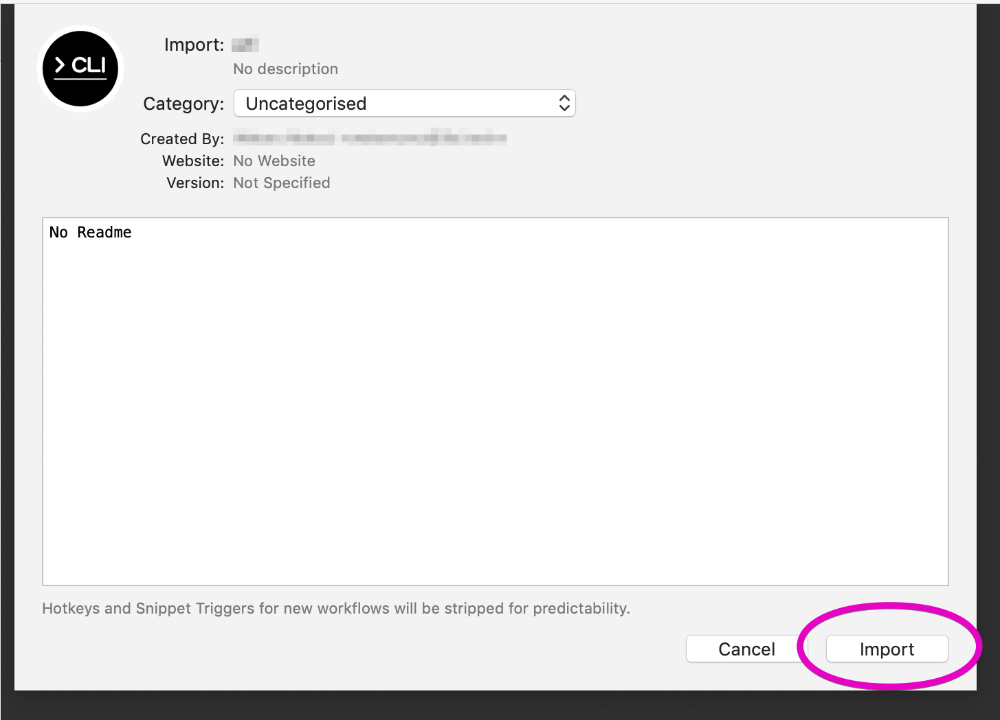
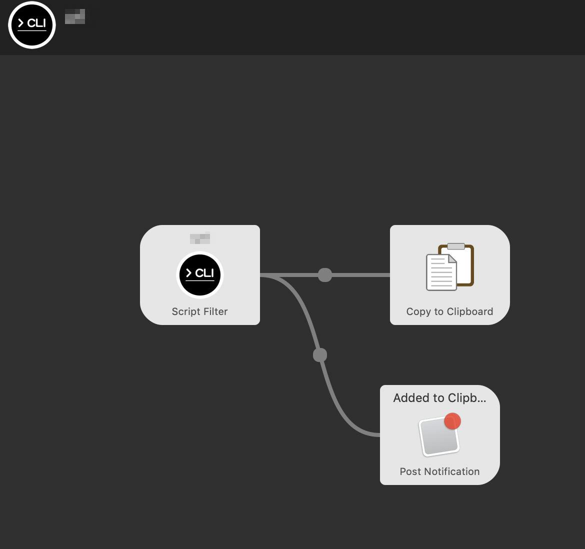
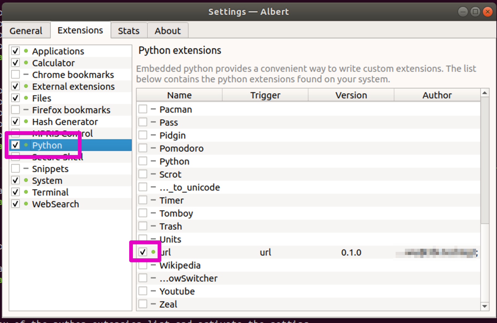

# cargo-launcher

[](https://travis-ci.com/watawuwu/cargo-launcher)
[](https://crates.io/crates/cargo-launcher)
[](https://docs.rs/crate/cargo-launcher)


If the cargo project is a binary crates, this tool can register the binary in the following launcher.

- [Alfred](https://www.alfredapp.com/workflows/)
    - Register as workflow
- [Hain](https://hainproject.github.io/hain/docs/)
    - Register as devplugin
- [Albert](https://albertlauncher.github.io/docs/extensions/python/)
    - Register as Python extension

## Demo
Alfred:


## Installation
cargo-launcher can be installed with cargo install:

``` shell
$ cargo install cargo-launcher
```

To upgrade:

``` shell
$ cargo install --force cargo-launcher
```

The resulting binary should then be in $HOME/.cargo/bin.

Or download binary from [gthub release page](https://github.com/watawuwu/cargo-launcher/releases).


## Usage

### Common

- Install target CLI binary(not cargo-launcher)

``` shell
$ cd {your binary crates project}

# Install to local, or manually install
#   The script path is set as follows
#   PATH=$HOME/.cargo/bin:$HOME/.local/bin:/usr/local/bin:$PATH
$ cargo install --path .
...
  Installing /Users/watawuwu/.cargo/bin/{your-binary}
```

### Alfred workflow

- Generate Alfredworkflow file

```
$ cargo launcher alfred
```

- Install to Alfred





### Hain plugin

- Export to hain devplugin directory

```
$ cargo launcher hain
```

- Restart Hain


### Albert plugin

- Export to albert module directory

```
$ cargo launcher albert
```

- Check the checkbox of the python extension list and activate the setting


